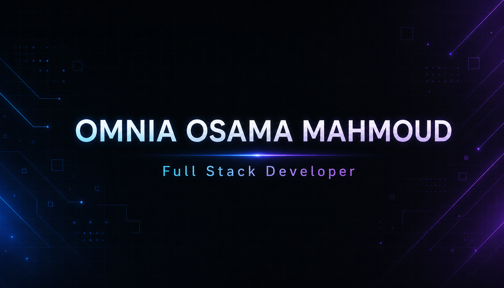

  

<h1 align="center">Omnia Osama Mahmoud</h1>
<h3 align="center">Full Stack Developer · React · TypeScript · Node.js</h3>

  
  

  
  
  

 

## Hello, folks! 👋

I'm a Full Stack Developer based in Egypt, specializing in **React, TypeScript, and Node.js**. I build production-grade web applications end to end — from responsive, bilingual frontends to secure REST APIs and relational/document databases. I also work as a **Full Stack MERN Instructor**, helping others build the same skill set.

 

## About

- 🎓 B.Sc. in Systems & Computers Engineering — Faculty of Engineering, Al-Azhar University (Grade: Very Good)
- 🧑‍💻 Trained in Full Stack MERN Development — ITI Mansoura
- 🏢 Experience building and maintaining a large-scale **B2B Marketplace Platform** in production
- 🌍 Comfortable delivering fully localized (Arabic/English, RTL-supported) interfaces
- 📚 Currently deepening my knowledge of system design and scalable backend architecture

 

## Technologies & Tools

**Languages**

  

**Frontend**

  

**Backend**

  

**Databases & Backend Services**

  

**Tools & Deployment**

  

 

## Currently Learning

  
  
  

- Advanced TypeScript patterns
- Next.js (App Router, SSR/SSG strategies)
- System design & scalable application architecture
- Backend architecture and best practices

 

## Featured Work

### 🏪 B2B Marketplace Platform
A large-scale, production B2B marketplace with buyer and vendor dashboards, marketplace search & filtering, RFQ workflows, vendor quotations, deals, payments, subscription plans with feature entitlement/usage limits, messaging, real-time notifications, and admin operations & analytics. Fully localized for Arabic and English with RTL support, and built with responsive, mobile-oriented interfaces.

`React` `JavaScript` `Supabase` `PostgreSQL` `Tailwind CSS` `i18next`

---

### 💰 Finova
A personal finance management web application covering authentication, income/expense tracking, transactions, categories, budgets, savings goals, recurring transactions, financial dashboards, and reports — with a bilingual, responsive UI.

`React` `TypeScript` `Node.js` `Express` `PostgreSQL` `Prisma` `Tailwind CSS` `Zod` `React Hook Form` `JWT`

---

### ✅ TaskFlow
A Kanban-style personal task management application with authentication, a personal workspace, boards, lists, and tasks. Supports English and Arabic with RTL, and a fully responsive interface.

`React` `JavaScript` `Node.js` `Express` `MongoDB`

 

## GitHub Stats

  
  

 

## Contact

  
  
  

 

  © 2026 Omnia Osama Mahmoud — Built with care, one commit at a time.

