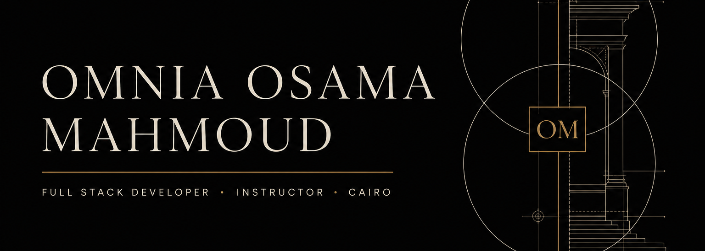

  

<h1 align="center">Omnia Osama Mahmoud</h1>

  <strong>Full Stack Developer &amp; MERN Instructor</strong> 
  Systems &amp; Computers Engineering · Cairo, Egypt

  &nbsp;&nbsp;
  &nbsp;&nbsp;
  &nbsp;&nbsp;
  

---

I design and ship full-stack web products with a systems mindset: clear interfaces, durable data models, and code that stays maintainable after launch. I also teach that craft — currently as a **Full Stack MERN Instructor**, working with developers who need to move from tutorials to production-ready applications.

My work sits at the intersection of product engineering and technical education. I care about architecture that scales, interfaces that stay usable under real constraints, and the discipline of explaining a system as well as building it.

**Currently focused on** Advanced TypeScript, Next.js, and system design.

## Selected work

### [Finova](https://github.com/omniaosamamahmood-prog/Finova)

A financial product experience built around clarity and trust — account-oriented workflows, restrained UI, and secure interaction patterns rather than visual noise.

### [TaskFlow](https://github.com/omniaosamamahmood-prog/TaskFlow)

A task management application for keeping work visible: structured lists, progress that is easy to scan, and a flow that stays out of the way of getting things done.

### B2B Marketplace Platform

A business-to-business marketplace for company discovery and commercial exchange — product catalog, counterpart matching, and the operational paths that sit between browse and close.

### [GameHaven API](https://github.com/omniaosamamahmood-prog/GameHaven-API)

A backend service for a games catalog: resource-oriented endpoints, structured data, and an API surface designed for a client to consume cleanly.

## Capabilities

<table>
<tr>
<td width="25%" valign="top">

<strong>Languages</strong>

JavaScript, TypeScript, HTML, CSS, C#

</td>
<td width="25%" valign="top">

<strong>Frontend</strong>

React, Next.js, Angular, Tailwind CSS, Vite

</td>
<td width="25%" valign="top">

<strong>Backend &amp; data</strong>

Node.js, Express, MongoDB, PostgreSQL, Supabase, Prisma

</td>
<td width="25%" valign="top">

<strong>Tooling</strong>

Git, GitHub, VS Code, Postman, Vercel

</td>
</tr>
</table>

## Background

| | |
| --- | --- |
| **Role** | Full Stack MERN Instructor |
| **Education** | B.Sc. Systems & Computers Engineering, Al-Azhar University — Very Good |
| **Training** | ITI Mansoura, Full Stack MERN |
| **Location** | Cairo, Egypt |

## Contact

Open to product engineering roles, teaching collaborations, and conversations about well-built web systems.

- [LinkedIn](https://www.linkedin.com/in/omnia-osama-6754b3206/)
- [Email](mailto:anaomnia47@gmail.com)
- [Resume](https://drive.google.com/file/d/17yYfyT-OG_Q_eUrqw_3tqnNjLXgeARWt/view?usp=sharing)
- [GitHub](https://github.com/omniaosamamahmood-prog)
- [Facebook](https://www.facebook.com/profile.php?id=61566883538588)
- [Instagram](https://www.instagram.com/omniaosama2002/)
